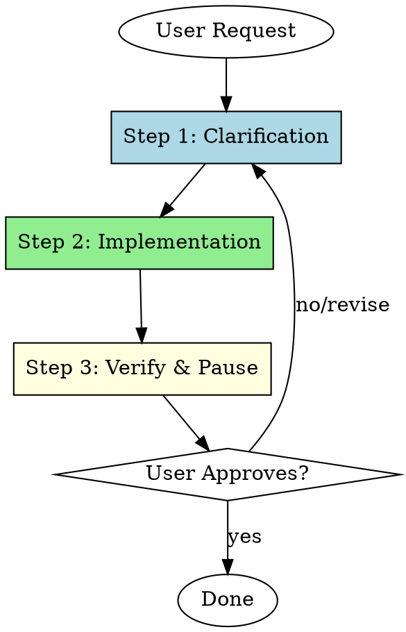

# Agile UI Development

A disciplined workflow for iterative, user-driven UI changes. Emphasizes small changes, immediate feedback, and explicit approval gates.

## Overview

This skill enforces a tight feedback loop for UI development:
1. Understand exactly what the user wants
2. Make one small change
3. Show it and wait for approval

**Core principle:** Never batch UI changes. One change, one verification, one approval at a time.

## Workflow

---

## Step 1: Clarification

**Goal:** Ensure thorough understanding before taking any action.

When receiving a UI change request:

1. **Read the relevant code first** — Understand the current implementation before proposing changes
2. **Ask specific questions** — Clarify ambiguous requirements with targeted questions
3. **Confirm the scope** — Verify you understand what "done" looks like

**Maintain a patient tone.** Rushing to implementation causes rework.

**Example clarifying questions:**
- "Should this change affect mobile layouts as well?"
- "Do you want to modify the existing component or create a new variant?"
- "What's the expected behavior when [edge case]?"

**Red flags that mean you need more clarification:**
- User's request could be interpreted multiple ways
- Change affects multiple components or files
- User used vague terms like "make it better" or "improve the styling"

---

## Step 2: Implementation

**Goal:** Apply a single, small, focused change.

Rules for implementation:

1. **One change at a time** — Do not batch multiple UI tweaks
2. **Minimal scope** — Change only what's necessary to satisfy the request
3. **Preserve existing behavior** — Don't refactor surrounding code unless explicitly requested
4. **Keep it simple** — Avoid over-engineering or adding "improvements"

**What counts as "one change":**
- Adjusting a single CSS property or Tailwind class
- Modifying one component's props or state
- Adding or removing a single UI element
- Changing text content in one location

**What requires multiple cycles:**
- Changes to multiple components
- Both styling and behavior changes
- Layout changes that cascade to other elements

---

## Step 3: Verification and Pause

**Goal:** Confirm the change works and wait for user approval.

1. **Start or verify the dev server** — Run the necessary command (e.g., `npm run dev`, `pnpm dev`)
2. **Confirm the server is running** — Verify the local development environment is accessible
3. **Pause immediately** — Do not proceed to additional changes
4. **Explicitly ask the user to check** — Tell them where to look and what to verify

**Required pause message format:**

> The dev server is running at [URL].
>
> Please check the [component/page/section] and let me know if this change looks right or if you'd like any adjustments.

**Do NOT:**
- Make additional changes while waiting
- Assume approval from silence
- Move to the next item in a list without explicit go-ahead
- Batch pending changes "while we're at it"

---

## Common Mistakes

| Mistake | Why It's Wrong | Fix |
|---------|----------------|-----|
| Batching multiple UI tweaks | User can't isolate which change caused issues | One change per cycle |
| Refactoring nearby code | Introduces risk without user request | Only change what's asked |
| Skipping clarification | Leads to wrong implementation | Ask first, code second |
| Assuming approval | User may see issues you don't | Wait for explicit confirmation |
| Moving too fast | User feels out of the loop | Pause and report after each change |

---

## Red Flags — Stop and Clarify

- "While I'm here, I'll also..."
- "This could be improved by..."
- "Let me just quickly also..."
- "I'll batch these similar changes..."
- User request has multiple "and" clauses

**When you catch yourself thinking these: STOP. Complete the current change, get approval, then address the next item.**
